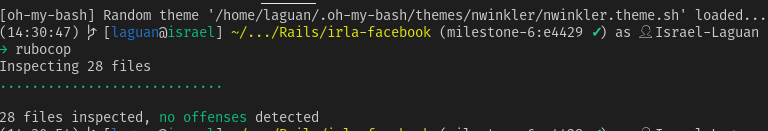
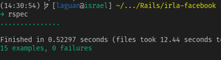
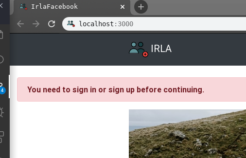
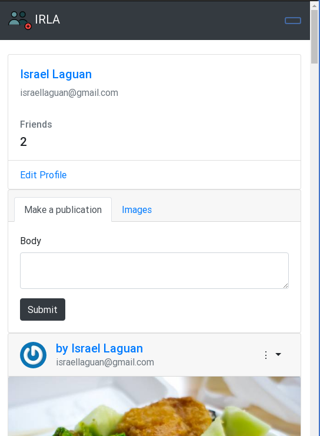
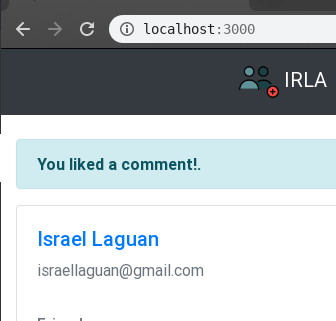
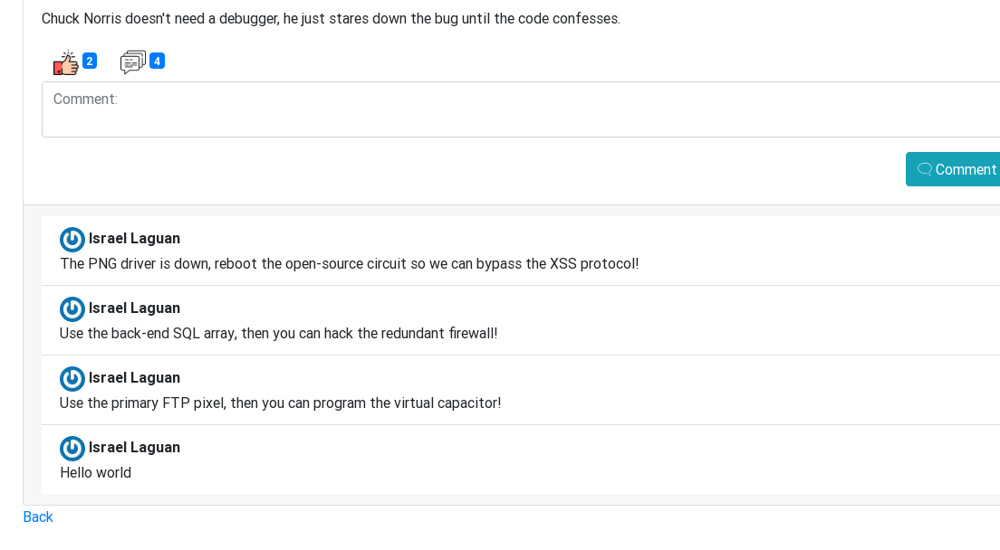

<!-- PROJECT SHIELDS -->
<!--
*** I'm using markdown "reference style" links for readability.
*** Reference links are enclosed in brackets [ ] instead of parentheses ( ).
*** See the bottom of this document for the declaration of the reference variables
*** for contributors-url, forks-url, etc. This is an optional, concise syntax you may use.
*** https://www.markdownguide.org/basic-syntax/#reference-style-links
-->

[![Contributors][contributors-shield]][contributors-url]
[![Forks][forks-shield]][forks-url]
[![Stargazers][stars-shield]][stars-url]
[![Issues][issues-shield]][issues-url]
[![MIT License][license-shield]][license-url]

<!-- PROJECT LOGO -->
 

  

  <h3 align="center">
	irla-Facebook
  </h3>

  

    An impememnation of a social media site like facebook with most backend compatibility
     
    <a href="https://github.com/raheebwa/irla-facebook/blob/master/README.md"><strong>Explore the docs 📚</strong></a>
     
     
	  🖊️
    <a href="https://www.theodinproject.com/courses/ruby-on-rails/lessons/final-project">Assigment</a>
    🐛
    <a href="https://github.com/raheebwa/irla-facebook/issues">Report Bug</a>
    🙏
    <a href="https://github.com/raheebwa/irla-facebook/issues">Request Feature</a>
  

# Live App on Heroku

<a href="http://irla.herokuapp.com">Click here to see live App</a>

## Validations

Rubocop:

RSpec:

## Features

- Sign In with Facebook

- Protected routes

- Basic Responsiveness

- Timeline like index page

- Like posts

- Make comments

- Using postgres databases for development and production (postgres)
- Followed the tutorial
- Tests made with [`RSpec`](https://relishapp.com/rspec/)

## Built With

- `ruby` v2.5.5
- `rails` v5.2.3+
- RVM
- `vscode` with _Ruby_ and _Rubocop_ extensions
- Linux
- Love and Passion for code.

# Authors

- [Aheebwa Ramadhan](https://github.com/raheebwa)
<table style="width:100%">
  <tr>
    <td>
        

            
            <h2>
                <a href="https://israel-laguan.github.io/" target="_blank" rel="author">
                    Israel Laguan
                </a>
            </h2>
        

    </td>
    <td>
        

            <a href="mailto:israellaguan@gmail.com" target="_blank" rel="author">
                
                <h3>
                    Email me to 
                    <a href="mailto:israellaguan@gmail.com">
                        israellaguan@gmail.com
                    </a>
                </h3>
            </a>
            <a href="https://www.linkedin.com/in/israellaguan/" target="_blank" rel="author">
                
                <h3>
                    Connect to my Linkedin
                </h3>
            </a>
            <a href="https://github.com/Israel-Laguan" target="_blank" rel="author">
                
                <h3>
                    Check my GitHub Profile
                </h3>
            </a>
        

    </td>
  </tr>
</table>

# License

This project is licensed under the MIT License - see the [LICENSE.md](LICENSE.md) file for details

<!-- ACKNOWLEDGEMENTS -->

## Acknowledgements

- [Microverse](https://www.microverse.org/)
- [The Odin Project](https://www.theodinproject.com/)
- [Readme header author](https://github.com/collinsugwu/Microverse201-Enumerable-Methods)

<!-- MARKDOWN LINKS & IMAGES -->
<!-- https://www.markdownguide.org/basic-syntax/#reference-style-links -->

[contributors-shield]: https://img.shields.io/github/contributors/raheebwa/irla-facebook.svg?style=flat-square
[contributors-url]: https://github.com/raheebwa/irla-facebook/graphs/contributors
[forks-shield]: https://img.shields.io/github/forks/raheebwa/irla-facebook
[forks-url]: https://github.com/raheebwa/irla-facebook/network/members
[stars-shield]: https://img.shields.io/github/stars/raheebwa/irla-facebook
[stars-url]: https://github.com/raheebwa/irla-facebook/stargazers
[issues-shield]: https://img.shields.io/github/issues/raheebwa/irla-facebook
[issues-url]: https://github.com/raheebwa/irla-facebook/issues
[license-shield]: https://img.shields.io/github/license/raheebwa/irla-facebook
[license-url]: https://github.com/raheebwa/irla-facebook/blob/master/LICENSE.txt
